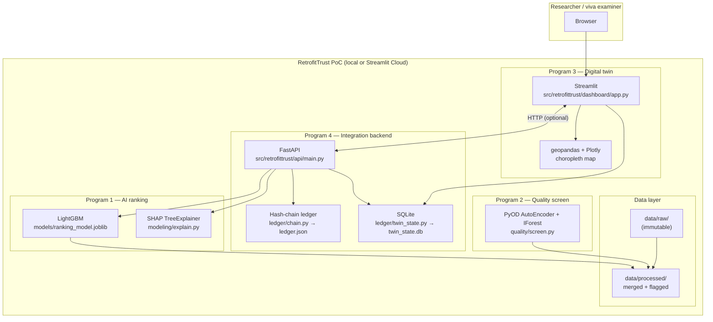

# RetrofitTrust Birmingham — Architecture Diagram

PoC stack for MSc dissertation: AI ranking, Streamlit digital twin, Python hash-chain ledger, FastAPI orchestration. **Not production** — no auth, no real blockchain network.

## System context



## Component responsibilities

| Component | Technology | Role |
|-----------|------------|------|
| Digital twin | Streamlit, geopandas, Plotly | Cohort UI, choropleth, SHAP panel, read SQLite state |
| API | FastAPI, Pydantic | `/rank`, `/explain`, `/ledger/append`, `/ledger/verify` |
| Ranking model | LightGBM + joblib | LSOA retrofit priority scores |
| Explainability | SHAP TreeExplainer | Local feature attributions (correlated-feature caveat) |
| Anomaly screen | PyOD ensemble | Flags low-confidence records — never silent delete |
| Ledger | Python `hashlib` SHA-256 | Append-only tamper-evident audit log |
| Twin persistence | SQLite (`sqlite3`) | Write-back loop when verification events land |
| Synthetic grants | `ledger/synthetic.py` | Demo eligibility / works / verification payloads |

## API surface (no authentication)

| Method | Path | Purpose |
|--------|------|---------|
| GET | `/health` | Model + ledger status |
| POST | `/rank` | Rank LSOA cohort; cache scores to SQLite |
| POST | `/explain` | SHAP (or composite fallback) for one LSOA |
| POST | `/ledger/append` | Append hash-chained event; update twin state |
| GET | `/ledger/verify` | Walk chain; return validity + recent blocks |
| GET | `/ledger/tamper-demo` | In-memory tamper evidence (dissertation demo) |

CORS is open (`allow_origins=["*"]`) for PoC local demos only.

## Ledger block structure

```python
{
  "index": 1,
  "timestamp": "2026-08-26T14:00:00+00:00",
  "data": {
    "type": "eligibility",           # or works_claimed | verification
    "lsoa_code": "E01000001",
    "label": "SYNTHETIC DATA",
    ...
  },
  "previous_hash": "<64-char hex>",
  "hash": "<64-char hex>"
}
```

Hashing: `json.dumps(block_without_hash, sort_keys=True)` → SHA-256.

## Write-back rule (PoC)

When a `verification` event is appended:

1. `verified_outcomes` row inserted (synthetic flag set).
2. `lsoa_state.verified = 1`.
3. Cached `priority_score` multiplied by `0.5` (`VERIFIED_PRIORITY_DECAY`).
4. Streamlit re-reads SQLite on next interaction (`db_mtime_token` cache bust).

## Deployment notes

- **Local:** `uvicorn retrofittrust.api.main:app --app-dir src` + `streamlit run src/retrofittrust/dashboard/app.py`
- **Integration script:** `python scripts/run_integration_demo.py` (HTTP or `--force-direct`)
- **Tests:** `python -m unittest discover -s tests -v`

Synthetic grant/installer data is labelled **SYNTHETIC DATA** in code, API responses, and UI badges.
