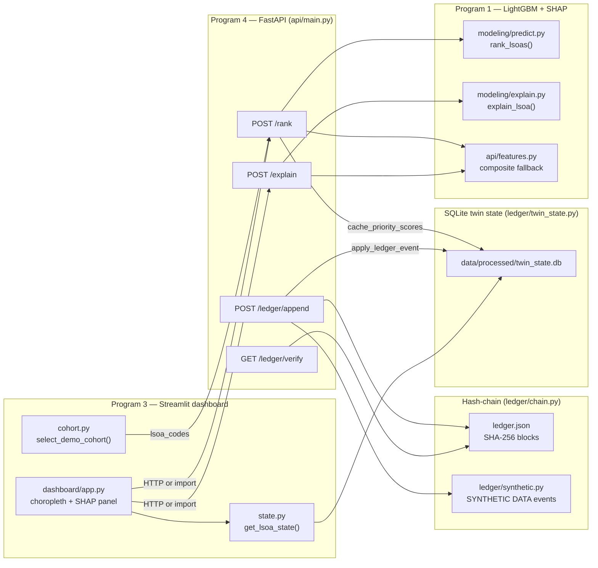
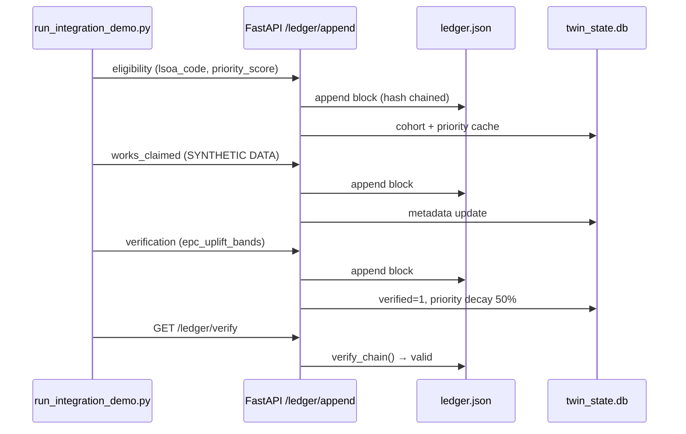
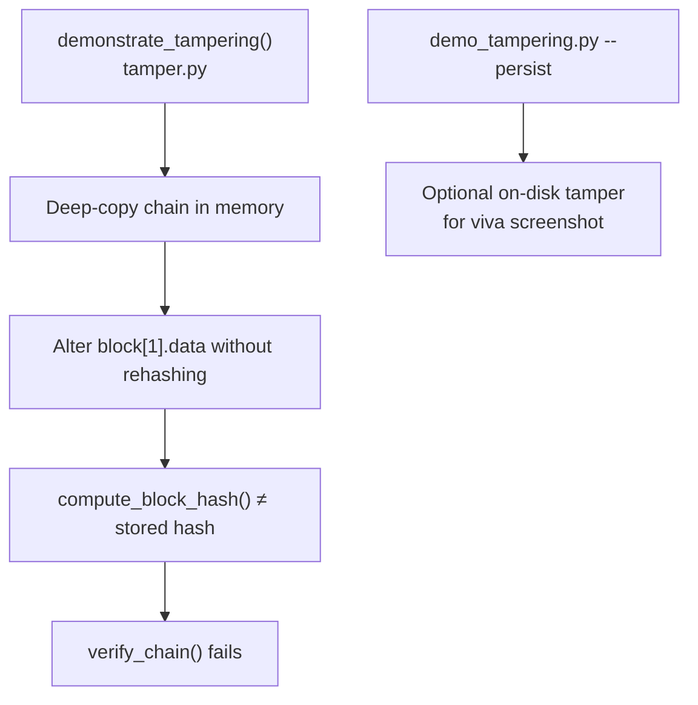

# RetrofitTrust Birmingham — Data Flow Diagram

This diagram matches the **actual Python code paths** in `src/retrofittrust/` (Streamlit + FastAPI + hash-chain + SQLite). There is no Next.js frontend in this PoC.

## End-to-end integration loop

## Ledger event sequence (synthetic grant lifecycle)

## Block schema (on disk)

Each block in `data/processed/ledger.json`:

| Field | Type | Description |
|-------|------|-------------|
| `index` | int | Monotonic block number (0 = genesis) |
| `timestamp` | ISO 8601 UTC | Append time |
| `data` | object | Event payload (`type`, `lsoa_code`, …) |
| `previous_hash` | str (64 hex) | SHA-256 of prior block |
| `hash` | str (64 hex) | SHA-256 of canonical JSON (excluding `hash`) |

Event types in `data.type`: `genesis`, `eligibility`, `works_claimed`, `verification`.

Grant/installer/inspection fields are **SYNTHETIC DATA** (see `ledger/synthetic.py`).

## Tamper-evidence demo

## Key files

| Step | Module |
|------|--------|
| Cohort selection | `dashboard/cohort.py`, `scripts/run_integration_demo.py` |
| Ranking | `api/main.py` → `modeling/predict.py` or `api/features.py` |
| SHAP | `api/main.py` → `modeling/explain.py` or `api/features.py` |
| Ledger append | `ledger/chain.py`, `ledger/synthetic.py` |
| Write-back | `ledger/twin_state.py` |
| Dashboard refresh | `dashboard/state.py`, `dashboard/data_loader.py` |
